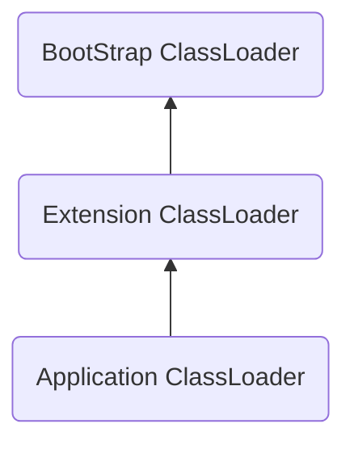

## 什么是CAS

CAS是compare and swap的简称，字面意思就是比较并交换，这里的交换其实就是更新的意思，是线程本地缓存和系统内存之间的数据交换。从内存上取值A，和预期值B比较，如果内存值A和预期值B结果相同，那么我们就把新值C更新到内存，如果不想等，就重复上述过程直到操作成功为止。

## CAS过程

以AtomicInteger为例：

```java
    public final int incrementAndGet() {
        return unsafe.getAndAddInt(this, valueOffset, 1) + 1;
    }
```

这是AtomicInteger的自增方法，返回自增后的值。

看到这里调用的是Unsafe类的方法`getAndAddInt`。

Unsafe 类是个跟底层硬件CPU指令通讯的复制工具类。Unsafe类提供了硬件级别的原子操作，主要有以下功能：
- 分配内存、释放内存：类中提供的3个本地方法`allocateMemory`、`reallocateMemory`、`freeMemory`分别用于分配内存，扩充内存和释放内存，与C语言中的3个方法对应。
- 可以定位对象某字段的内存位置，也可以修改对象的字段值，即使它是私有的。
  - 字段的定位：JAVA中对象的字段的定位可能通过`staticFieldOffset`方法实现，该方法返回给定field的内存地址偏移量，这个值对于给定的filed是唯一的且是固定不变的。`getIntVolatile`方法获取对象中offset偏移地址对应的整型field的值,支持volatile load语义。`getLong`方法获取对象中offset偏移地址对应的long型field的值
  - 数组元素定位：Unsafe类中有很多以BASE_OFFSET结尾的常量，比如ARRAY_INT_BASE_OFFSET，ARRAY_BYTE_BASE_OFFSET等，这些常量值是通过`arrayBaseOffset`方法得到的。`arrayBaseOffset`方法是一个本地方法，可以获取数组第一个元素的偏移地址。Unsafe类中还有很多以INDEX_SCALE结尾的常量，比如 ARRAY_INT_INDEX_SCALE ， ARRAY_BYTE_INDEX_SCALE等，这些常量值是通过`arrayIndexScale`方法得到的。`arrayIndexScale`方法也是一个本地方法，可以获取数组的转换因子，也就是数组中元素的增量地址。将`arrayBaseOffset`与`arrayIndexScale`配合使用，可以定位数组中每个元素在内存中的位置。
- 挂起与恢复。将一个线程进行挂起是通过`park`方法实现的，调用`park`后，线程将一直阻塞直到超时或者中断等条件出现。`unpark`可以终止一个挂起的线程，使其恢复正常。整个并发框架中对线程的挂起操作被封装在`LockSupport`类中，`LockSupport`类中有各种版本`pack`方法，但最终都调用了`Unsafe.park()`方法。
- CAS操作。是通过`compareAndSwapXXX`方法实现的。


下面是`getAndAddInt`方法：
```java
    public final int getAndAddInt(Object var1, long var2, int var4) {
        int var5;
        do {
            var5 = this.getIntVolatile(var1, var2);
        } while(!this.compareAndSwapInt(var1, var2, var5, var5 + var4));

        return var5;
    }
```
这里是一个循环，通过`getIntVolatile`获取var1对象中var2偏移地址对应的field的值，循环的条件是`compareAndSwapInt`方法返回false，如果`compareAndSwapInt`方法一直返回false，则继续调用`getIntVolatile`。

这里看一下`compareAndSwapInt`的参数列表：
1. this，Unsafe 对象本身，需要通过这个类来获取 value 的内存偏移地址。这里是var1。
2. valueOffset，value 变量的内存偏移地址。这里是var2。
3. expect，期望更新的值。这里是var5。
4. update，要更新的最新值。这里是var5+var4。

在这个方法里，如果expect期望值与field的当前值相同，CPU会设置field的值为update这个新值。否则不做任何操作。无论哪种情况，它都会在CAS指令之前返回该位置的值。

下面是c++实现代码:

```cpp
static inline bool
compareAndSwap (volatile jint *addr, jint old, jint new_val)
{
  jboolean result = false;
  spinlock lock;
  if ((result = (*addr == old)))
    *addr = new_val;
  return result;
}
```

这里很关键的一个变量就是valueOffset。

```java
// setup to use Unsafe.compareAndSwapInt for updates
    private static final Unsafe unsafe = Unsafe.getUnsafe();
    private static final long valueOffset;

    static {
        try {
            valueOffset = unsafe.objectFieldOffset
                (AtomicInteger.class.getDeclaredField("value"));
        } catch (Exception ex) { throw new Error(ex); }
    }

    private volatile int value;
```

AtomicInteger类在rt.jar包下，所以AtomicInteger类是通过Bootstrap根类加载器进行加载的。

```java
@CallerSensitive
    public static Unsafe getUnsafe() {
        Class var0 = Reflection.getCallerClass();
        if (!VM.isSystemDomainLoader(var0.getClassLoader())) {
            throw new SecurityException("Unsafe");
        } else {
            return theUnsafe;
        }
    }
```

类加载器委托关系：


当AtomicInteger加载当时候，静态代码块会执行，通过`Unsafe.getUnsafe()`获取到unsafe实例，通过反射获取到保存着实际值的value字段对象，然后通过`objectFieldOffset`获取到这个value字段对象对应的offset。这样后面的cas操作就可以正常使用了。